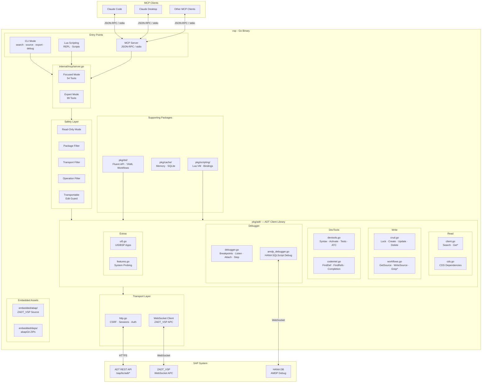
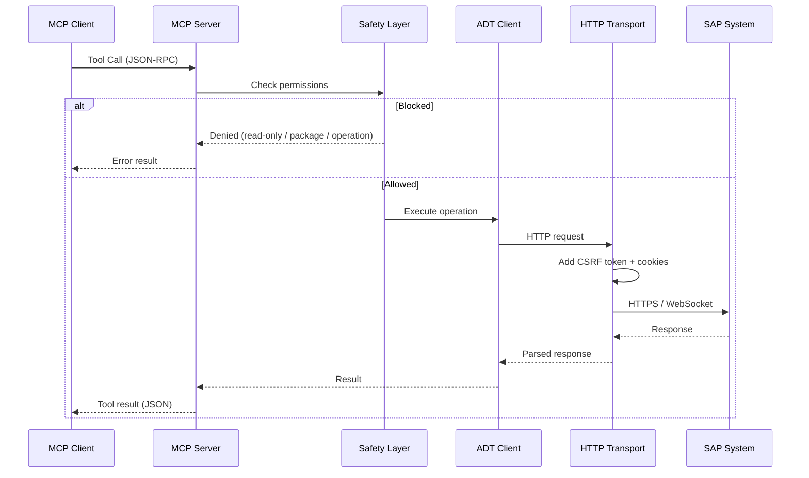
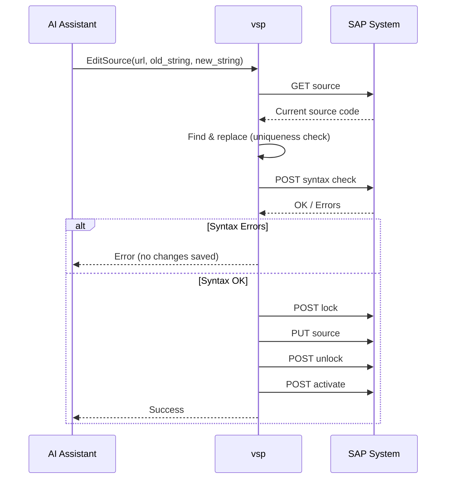
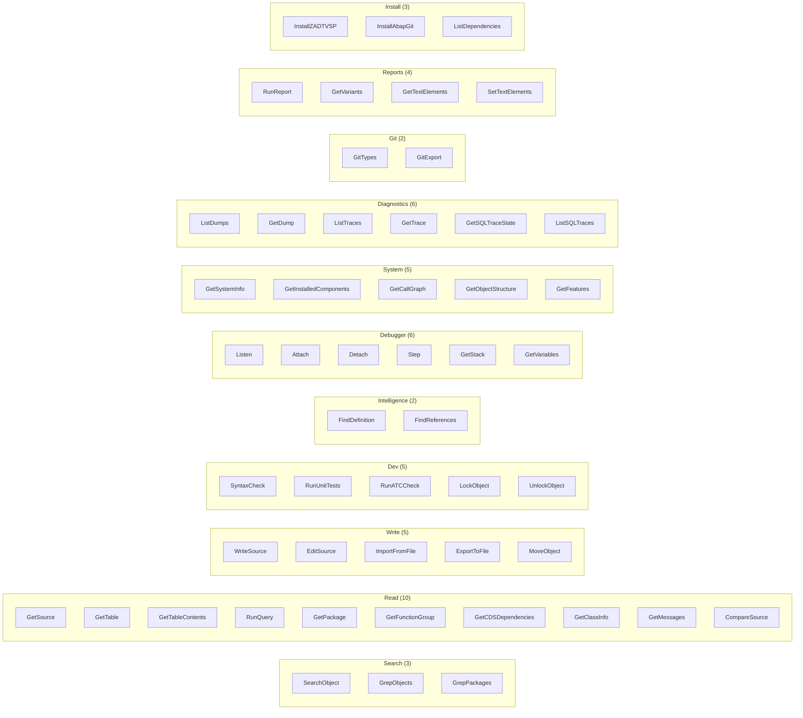
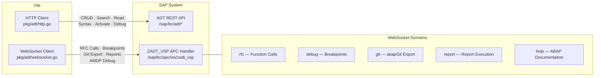
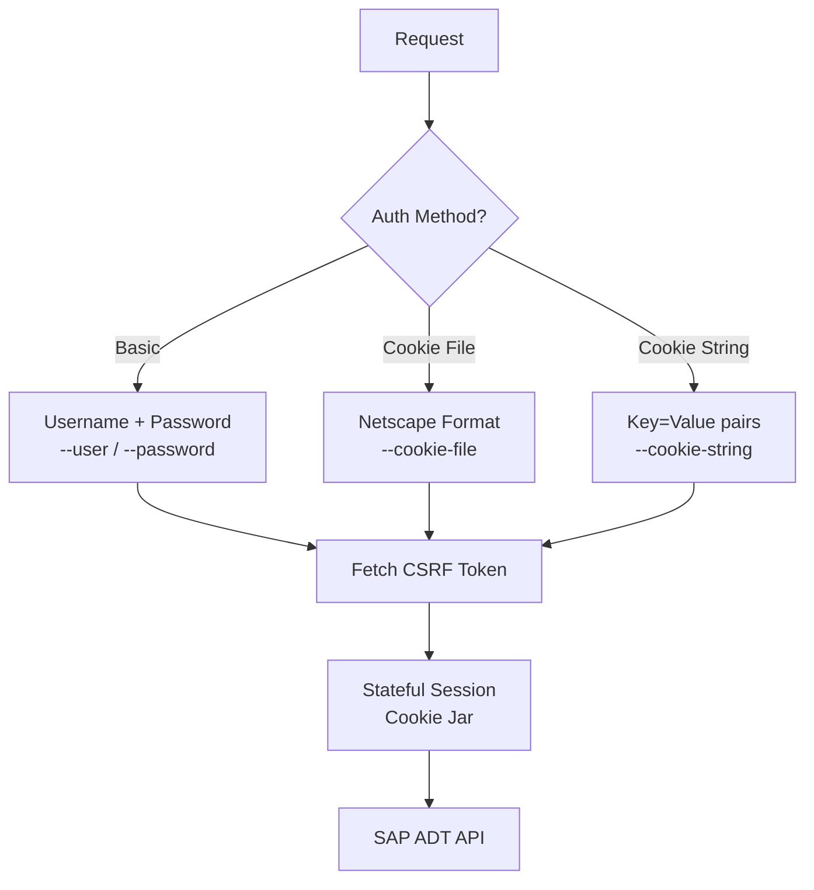
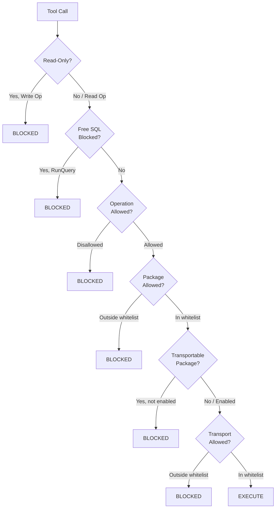

# vsp Architecture

## High-Level Architecture



## Request Flow



## Write Operation Flow (EditSource)



## Tool Categories



## Dual Transport: HTTP + WebSocket



## Package Structure

```
vibing-steampunk/
├── cmd/vsp/                    # CLI entry point (cobra/viper)
│   └── main.go                 #   Flags, env vars, auth, server startup
│
├── internal/mcp/               # MCP protocol layer
│   └── server.go               #   99 tool handlers, mode-aware registration
│
├── pkg/adt/                    # ADT client library (core)
│   ├── client.go               #   Read operations + search
│   ├── crud.go                 #   Lock / create / update / delete
│   ├── devtools.go             #   Syntax check, activate, unit tests, ATC
│   ├── codeintel.go            #   Find definition, references, completion
│   ├── workflows.go            #   High-level: GetSource, WriteSource, Grep*
│   ├── debugger.go             #   External ABAP debugger (HTTP + WebSocket)
│   ├── amdp_debugger.go        #   HANA/AMDP SQLScript debugger
│   ├── ui5.go                  #   UI5/Fiori BSP management
│   ├── cds.go                  #   CDS view dependency analysis
│   ├── safety.go               #   Read-only, package/op filtering
│   ├── features.go             #   System capability detection
│   ├── http.go                 #   HTTP transport (CSRF, sessions, auth)
│   └── xml.go                  #   ADT XML type definitions
│
├── pkg/dsl/                    # Fluent API & workflow engine
│   ├── search.go               #   Search builder
│   ├── test_runner.go          #   Unit test orchestration
│   ├── workflow.go             #   YAML workflow engine
│   └── batch.go                #   Batch import/export, pipelines
│
├── pkg/scripting/              # Lua scripting engine
│   ├── lua.go                  #   Lua VM, REPL
│   └── bindings.go             #   40+ ADT tool bindings
│
├── pkg/cache/                  # Caching infrastructure
│   ├── memory.go               #   In-memory cache
│   └── sqlite.go               #   SQLite persistent cache
│
├── embedded/                   # Assets embedded in binary
│   ├── abap/                   #   ZADT_VSP ABAP source files
│   └── deps/                   #   abapGit ZIP packages
│
└── docs/                       # Documentation
    ├── architecture.md         #   This file
    ├── DSL.md                  #   DSL & workflow guide
    └── adr/                    #   Architecture Decision Records
```

## Authentication



## Safety System


